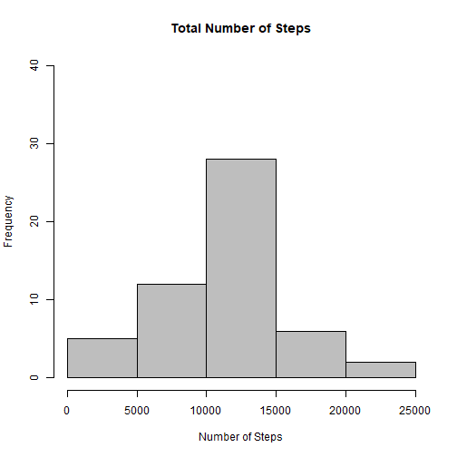
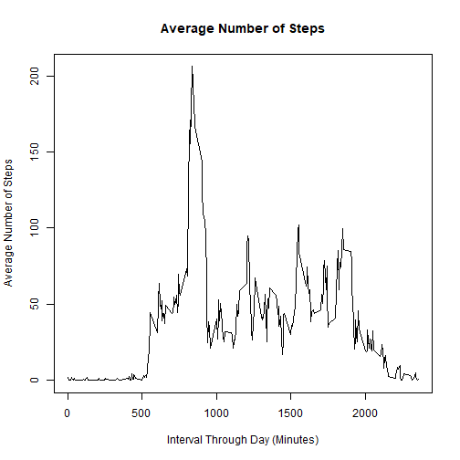
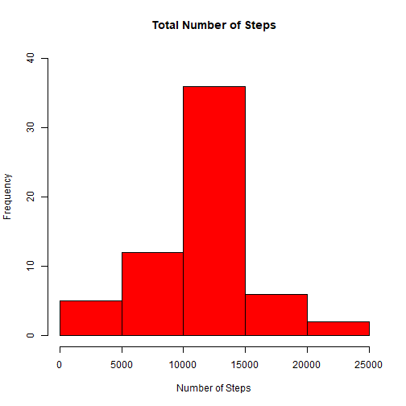
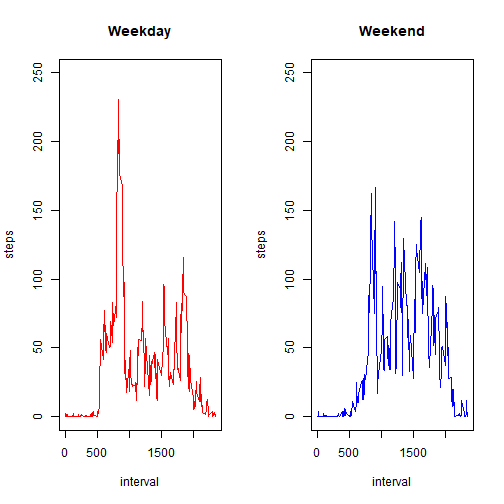

  
## 1. Code for reading in the dataset and/or processing the data


```r
activity <- read.csv("activity.csv", header=TRUE, na.strings = "NA")
```

## 2. Histogram of the total number of steps taken each day


```r
totalsteps <- aggregate(steps ~ date, data = activity, sum, na.rm = TRUE)

hist(totalsteps$steps, col="GREY", main="Total Number of Steps", xlab="Number of Steps", ylim = c(0, 40))
```



## 3. Mean and median number of steps taken each day


```r
meansteps <- mean(totalsteps$steps)
meansteps
```

```
## [1] 10766.19
```

```r
mediansteps <- median(totalsteps$steps)
mediansteps
```

```
## [1] 10765
```

* The mean of steps taken per day is 10766.19. 
* The median of steps taken per day is 10765.

## 4. Time series plot of the average number of steps taken


```r
stepsinterval <- aggregate(steps ~ interval, data = activity, mean, na.rm = TRUE)

plot(steps ~ interval, data = stepsinterval, type = "l", main="Average Number of Steps", xlab="Interval Through Day (Minutes)", ylab="Average Number of Steps")
```



## 5. The 5-minute interval that, on average, contains the maximum number of steps


```r
stepsinterval$interval[which.max(stepsinterval$steps)]
```

```
## [1] 835
```

* The 5 minute interval that contains the most number of steps is the 835th

## 6. Code to describe and show a strategy for imputing missing data


```r
na<-sum(is.na(activity))
na
```

```
## [1] 2304
```

* Total number of missing days is 2304


```r
activity2 <- activity

for (i in 1:length(activity2$steps)) {
  if (is.na(activity2[i, 1])) {
    steps_average <- subset(stepsinterval, stepsinterval$interval == as.numeric(activity2[i,3]))$steps
    activity2[i, 1] <- steps_average
  } else {
    activity2[i, 1] <- activity[i, 1]
  }
  activity2
}

totalsteps2 <- aggregate(steps ~ date, data = activity2, sum, na.rm = TRUE)

meansteps2 <- mean(totalsteps2$steps)
meansteps2
```

```
## [1] 10766.19
```

```r
mediansteps2 <- median(totalsteps2$steps)
mediansteps2
```

```
## [1] 10766.19
```

* The mean of steps taken per day is 10766.19 (same as mean before imputing NAs). 
* The median of steps taken per day is 10766.19 (0.01% above median before imputing NAs)

## 7. Histogram of the total number of steps taken each day after missing values are imputed


```r
hist(totalsteps2$steps, col="RED", main="Total Number of Steps", xlab="Number of Steps", ylim = c(0, 40))
```



## 8. Panel plot comparing the average number of steps taken per 5-minute interval across weekdays and weekends


```r
activity2date <- as.Date(activity2$date)

weekday <- c("Monday", "Tuesday", "Wednesday", "Thursday", "Friday")

day <- factor((weekdays(activity2date) %in% weekday),levels=c(FALSE, TRUE), labels=c("Weekend","Weekday"))

weekdayweekend <- aggregate(steps ~ interval + day, data = activity2, mean)

par(mfrow=c(1,2))
with(subset(weekdayweekend,day=="Weekday"), plot(interval,steps, type="l",main="Weekday",col="RED",ylim = c(0, 250)))
with(subset(weekdayweekend,day=="Weekend"), plot(interval,steps, type="l",main="Weekend",col="BLUE",ylim = c(0, 250)))
```


